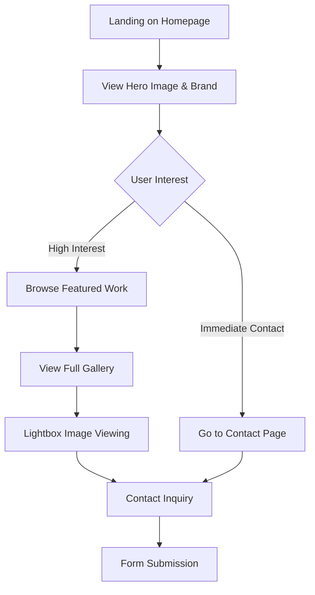

# Wedding Photography Website - Architectural Specification

## 1. Site Architecture & Information Hierarchy

### 1.1 Site Structure
```
Wedding Photography Website
├── Home (/)
│   ├── Hero Section
│   ├── About Preview
│   ├── Featured Work (4-6 images)
│   └── Contact CTA
├── Gallery (/gallery)
│   ├── Image Grid (50-80 curated images)
│   └── Lightbox Viewing
└── Contact (/contact)
    ├── Contact Form
    ├── Business Information
    └── Social Media Links
```

### 1.2 Information Hierarchy Principles
- **Primary Focus**: Photography showcase (60% of visual weight)
- **Secondary Focus**: Professional credibility and contact accessibility (30%)
- **Tertiary Focus**: Navigation and supporting content (10%)

### 1.3 User Journey Mapping


### 1.4 Content Strategy
- **Emotional Impact**: Leading with stunning visuals
- **Trust Building**: Professional presentation and credibility markers
- **Conversion Optimization**: Clear contact pathways from every page

## 2. Luxury Design Principles & Visual Identity

### 2.1 Core Design Philosophy
- **Elegance through Simplicity**: Minimal design that doesn't compete with photography
- **Premium Feel**: High-end aesthetic reflecting luxury wedding market
- **Timeless Appeal**: Classic design elements that won't date quickly
- **Photography-First**: Design serves to enhance, not distract from images

### 2.2 Visual Design Principles
- **White Space Dominance**: 70% white space to image content ratio
- **Subtle Sophistication**: Refined details without ostentation
- **Clean Lines**: Geometric precision in layout and typography
- **Purposeful Minimalism**: Every element serves a specific function

## 3. Color Palette & Typography Specifications

### 3.1 Color Palette
**Primary Colors:**
- **Pure White**: #FFFFFF (backgrounds, primary text areas)
- **Charcoal Black**: #1A1A1A (primary text, navigation)
- **Soft Gray**: #F8F8F8 (subtle backgrounds, form fields)

**Accent Colors:**
- **Warm Gray**: #666666 (secondary text, subtle borders)
- **Light Gray**: #E5E5E5 (dividers, inactive states)
- **Deep Black**: #000000 (high contrast elements, hover states)

**Optional Luxury Accent:**
- **Champagne Gold**: #D4AF37 (sparingly used for premium touches)

### 3.2 Typography System
**Primary Typeface (Headings):**
- Font: Playfair Display or similar elegant serif
- Weights: Light (300), Regular (400), Medium (500)
- Usage: Main headings, brand name, page titles

**Secondary Typeface (Body):**
- Font: Inter or Avenir Next (clean sans-serif)
- Weights: Light (300), Regular (400), Medium (500)
- Usage: Body text, navigation, form labels

**Typography Scale:**
- H1: 48px / 3rem (desktop), 36px / 2.25rem (mobile)
- H2: 36px / 2.25rem (desktop), 28px / 1.75rem (mobile)
- H3: 24px / 1.5rem (desktop), 20px / 1.25rem (mobile)
- Body: 16px / 1rem (desktop), 16px / 1rem (mobile)
- Small: 14px / 0.875rem (captions, form text)

## 4. Responsive Breakpoint Strategy

### 4.1 Mobile-First Approach
**Breakpoint System:**
- **Mobile**: 320px - 767px (primary design target)
- **Tablet**: 768px - 1023px (layout adaptation)
- **Desktop**: 1024px - 1440px (enhanced layout)
- **Large Desktop**: 1441px+ (maximum width constraints)

### 4.2 Responsive Design Strategy
**Mobile (320-767px):**
- Single column layouts
- Stacked navigation (hamburger menu)
- Touch-optimized spacing (44px minimum touch targets)
- Simplified image grids (1-2 columns)

**Tablet (768-1023px):**
- Two-column layouts where appropriate
- Horizontal navigation with adequate spacing
- Grid layouts with 2-3 columns for galleries
- Optimized for both portrait and landscape

**Desktop (1024px+):**
- Multi-column layouts with generous white space
- Horizontal navigation with hover states
- Grid layouts up to 4 columns for galleries
- Maximum content width: 1200px (centered)

## 5. Navigation Structure & User Flow

### 5.1 Navigation Design
**Desktop Navigation:**
- Horizontal menu bar at top
- Logo/brand name on left
- Menu items centered or right-aligned
- Subtle hover animations

**Mobile Navigation:**
- Hamburger menu icon (top right)
- Full-screen overlay menu
- Large touch targets
- Smooth slide animations

### 5.2 Navigation Items
```
[LOGO/BRAND]          [HOME] [GALLERY] [CONTACT]
```

**Navigation Behavior:**
- Fixed/sticky navigation on scroll
- Active page indication
- Smooth transitions between pages
- Consistent placement across all devices

## 6. Homepage Layout Specifications

### 6.1 Hero Section
**Desktop Layout:**
- Full viewport height (100vh)
- Large hero image (16:9 or 3:2 aspect ratio)
- Overlay text with photographer name/tagline
- Subtle scroll indicator

**Content Elements:**
- Photographer/Brand name (large, elegant typography)
- Tagline: "Capturing Love Stories" or similar (subtle, smaller text)
- Hero image: Stunning wedding photograph (couple or detail shot)
- Optional: Subtle animation on load

### 6.2 About Preview Section
**Layout:**
- Two-column layout (desktop) / single column (mobile)
- Left: Professional headshot or signature work image
- Right: Brief bio/approach text (2-3 sentences maximum)
- Understated design maintaining focus on photography

### 6.3 Featured Work Section
**Desktop Layout:**
- 3-column grid of featured images
- Equal aspect ratios (square or 4:3 recommended)
- Hover effects: subtle zoom or overlay
- "View Gallery" call-to-action

**Mobile Layout:**
- 2-column grid with adequate spacing
- Touch-friendly image sizes
- Clear tap indicators

### 6.4 Contact CTA Section
**Design:**
- Centered layout with generous white space
- Elegant typography for contact invitation
- Primary contact button
- Secondary information (email, phone)

## 7. Gallery Page Layout Specifications

### 7.1 Gallery Grid System
**Desktop Layout (1024px+):**
- 4-column masonry grid with equal width columns
- Variable heights maintaining aspect ratios
- Consistent 20px gutters between images
- Maximum grid width: 1200px (centered)

**Tablet Layout (768-1023px):**
- 3-column grid with 16px gutters
- Responsive image sizing
- Maintained aspect ratios

**Mobile Layout (320-767px):**
- 2-column grid with 12px gutters
- Optimized for touch interaction
- Adequate image preview size

### 7.2 Image Specifications
**Technical Requirements:**
- Minimum resolution: 1200px on longest side
- Optimized file sizes (WebP format preferred)
- Progressive loading implementation
- Aspect ratio preservation
- Alt text for accessibility

**Visual Standards:**
- Consistent color grading/editing style
- High-quality curation (50-80 images total)
- Balanced variety: ceremonies, receptions, portraits, details
- Emotional storytelling through image sequence

### 7.3 Loading Strategy
- Progressive image loading (lazy loading)
- Skeleton placeholders during load
- Smooth fade-in animations
- Loading indicator for slower connections

## 8. Lightbox Functionality & User Interactions

### 8.1 Lightbox Design
**Visual Design:**
- Full-screen overlay with subtle dark background (rgba(0,0,0,0.9))
- Centered image with automatic sizing
- Minimal UI elements (close, navigation, counter)
- Clean, unobtrusive design

**Navigation Elements:**
- Close button (top right, large touch target)
- Previous/Next arrows (left/right edges)
- Image counter ("3 of 50" - bottom center)
- Keyboard navigation support (arrow keys, escape)

### 8.2 Lightbox Interactions
**Desktop Behavior:**
- Click image to open lightbox
- Hover states for navigation elements
- Keyboard shortcuts (arrows, ESC, space)
- Mouse wheel for next/previous

**Mobile Behavior:**
- Touch to open lightbox
- Swipe gestures for navigation
- Tap zones for navigation (left/right 30% of screen)
- Pinch-to-zoom capability

### 8.3 Image Display Logic
- Automatic sizing to fit viewport
- Maintain aspect ratios
- High-resolution image loading in lightbox
- Smooth transition animations (300ms)
- Preload adjacent images for smooth navigation

## 9. Contact Page Layout Specifications

### 9.1 Page Structure
**Layout Hierarchy:**
- Page title/heading
- Contact form (primary focus)
- Business information section
- Social media links

### 9.2 Contact Form Design
**Form Fields:**
- Name (required, text input)
- Email (required, email validation)
- Message (required, textarea, 4-5 rows)
- Submit button ("Send Message" or "Get In Touch")

**Form Styling:**
- Clean, minimal design
- Consistent spacing (24px between fields)
- Subtle borders (#E5E5E5)
- Focus states with gentle transitions
- Error validation with clear messaging
- Success confirmation message

**Form Layout:**
- Single column layout (all screen sizes)
- Maximum width: 600px
- Centered alignment
- Generous white space around form

### 9.3 Business Information Section
**Content Elements:**
- Email address (clickable mailto link)
- Phone number (clickable tel link on mobile)
- Business address (if applicable)
- Operating hours/availability

**Design Treatment:**
- Elegant typography hierarchy
- Subtle separation from form
- Consistent with overall design language

### 9.4 Social Media Integration
**Platform Links:**
- Instagram (primary for wedding photographers)
- Facebook
- Pinterest (optional)

**Design Implementation:**
- Subtle icon design
- Hover/touch states
- Opens in new tab
- Consistent with brand aesthetic

## 10. Technical Requirements & Performance

### 10.1 Performance Optimization
**Image Optimization:**
- WebP format with fallbacks
- Responsive image sizes (srcset)
- Lazy loading implementation
- Progressive image enhancement
- CDN delivery recommended

**Core Web Vitals Targets:**
- Largest Contentful Paint (LCP): < 2.5s
- First Input Delay (FID): < 100ms
- Cumulative Layout Shift (CLS): < 0.1

### 10.2 SEO Requirements
**Meta Tags:**
- Descriptive page titles
- Meta descriptions for each page
- Open Graph tags for social sharing
- Structured data for business information

**Content Optimization:**
- Alt text for all images
- Semantic HTML structure
- Clean URL structure (/gallery, /contact)
- XML sitemap generation

### 10.3 Accessibility Standards
**WCAG 2.1 AA Compliance:**
- Sufficient color contrast ratios (4.5:1 minimum)
- Keyboard navigation support
- Screen reader compatibility
- Focus indicators
- Alt text for images
- Form label associations

### 10.4 Browser Compatibility
**Supported Browsers:**
- Chrome (latest 2 versions)
- Firefox (latest 2 versions)
- Safari (latest 2 versions)
- Edge (latest 2 versions)
- Mobile browsers (iOS Safari, Chrome Mobile)

### 10.5 Hosting & Technical Stack
**Recommended Stack:**
- Static site generation (Gatsby, Next.js, or similar)
- Headless CMS for content management (optional)
- CDN for image delivery
- SSL certificate (HTTPS required)
- Analytics integration (Google Analytics)

## 11. Wireframes & Layout Descriptions

### 11.1 Homepage Wireframe Description
```
┌─────────────────────────────────────────┐
│ [LOGO]              [HOME][GALLERY][CONTACT] │
├─────────────────────────────────────────┤
│                                         │
│           HERO IMAGE                    │
│         (Full Viewport)                 │
│                                         │
│        [Photographer Name]              │
│         [Elegant Tagline]               │
│                                         │
├─────────────────────────────────────────┤
│                                         │
│  [About Image]    [About Text]          │
│   (Optional)      (Brief Bio)           │
│                                         │
├─────────────────────────────────────────┤
│                                         │
│    [Featured Work - 3 Column Grid]      │
│     [Image 1] [Image 2] [Image 3]       │
│     [Image 4] [Image 5] [Image 6]       │
│                                         │
│          [View Full Gallery]            │
│                                         │
├─────────────────────────────────────────┤
│                                         │
│           [Contact CTA]                 │
│        "Let's Create Magic"             │
│           [Get In Touch]                │
│                                         │
└─────────────────────────────────────────┘
```

### 11.2 Gallery Page Wireframe Description
```
┌─────────────────────────────────────────┐
│ [LOGO]              [HOME][GALLERY][CONTACT] │
├─────────────────────────────────────────┤
│                                         │
│              Gallery                    │
│                                         │
├─────────────────────────────────────────┤
│                                         │
│  [IMG] [IMG] [IMG] [IMG]                │
│  [IMG] [IMG] [IMG] [IMG]                │
│  [IMG] [IMG] [IMG] [IMG]                │
│  [IMG] [IMG] [IMG] [IMG]                │
│  [IMG] [IMG] [IMG] [IMG]                │
│                                         │
│          (Masonry Grid Layout)          │
│                                         │
└─────────────────────────────────────────┘
```

### 11.3 Contact Page Wireframe Description
```
┌─────────────────────────────────────────┐
│ [LOGO]              [HOME][GALLERY][CONTACT] │
├─────────────────────────────────────────┤
│                                         │
│              Contact                    │
│                                         │
├─────────────────────────────────────────┤
│                                         │
│             [Contact Form]              │
│            ┌─────────────┐              │
│            │    Name     │              │
│            └─────────────┘              │
│            ┌─────────────┐              │
│            │    Email    │              │
│            └─────────────┘              │
│            ┌─────────────┐              │
│            │             │              │
│            │   Message   │              │
│            │             │              │
│            └─────────────┘              │
│            [Send Message]               │
│                                         │
├─────────────────────────────────────────┤
│                                         │
│          Business Information           │
│           email@example.com             │
│            (555) 123-4567               │
│                                         │
│        [Instagram] [Facebook]           │
│                                         │
└─────────────────────────────────────────┘
```

## 12. Implementation Recommendations

### 12.1 Development Phases
**Phase 1: Foundation**
- Setup development environment
- Implement responsive grid system
- Create typography and color systems
- Build navigation component

**Phase 2: Core Pages**
- Develop homepage layout
- Implement contact form functionality
- Create basic gallery structure

**Phase 3: Advanced Features**
- Implement lightbox functionality
- Add image optimization
- Performance optimization
- Mobile responsiveness refinement

**Phase 4: Polish & Launch**
- Accessibility testing and fixes
- Cross-browser testing
- SEO implementation
- Final content integration

### 12.2 Content Preparation Guidelines
**Photography Requirements:**
- High-resolution source images (minimum 2000px)
- Consistent editing style and color grading
- Variety of wedding moments and details
- Professional quality curation

**Text Content:**
- Compelling photographer bio
- Clear service descriptions
- Professional contact information
- SEO-optimized page content

### 12.3 Success Metrics
**Performance Metrics:**
- Page load times under 3 seconds
- Mobile-friendly test passing
- Core Web Vitals compliance

**Business Metrics:**
- Contact form conversion rate
- Gallery engagement time
- Mobile vs desktop usage patterns
- Social media referral traffic

---

## Summary

This architectural specification provides a comprehensive blueprint for creating a luxury wedding photography website that prioritizes visual excellence while maintaining sophisticated simplicity. The design focuses on showcasing photography work through clean, minimal layouts that build trust and encourage client inquiries.

**Key Design Principles:**
- Photography-first approach with minimal distractions
- Luxury aesthetic targeting high-end wedding clients
- Mobile-optimized responsive design
- Performance and accessibility standards compliance

**Technical Deliverables:**
- Three-page structure (Home, Gallery, Contact)
- Responsive grid systems for all devices
- Professional lightbox gallery functionality
- Optimized contact form with validation
- Performance-optimized image delivery

This specification serves as a complete guide for developers to create a website that effectively represents a luxury wedding photography business while providing an exceptional user experience across all devices.
